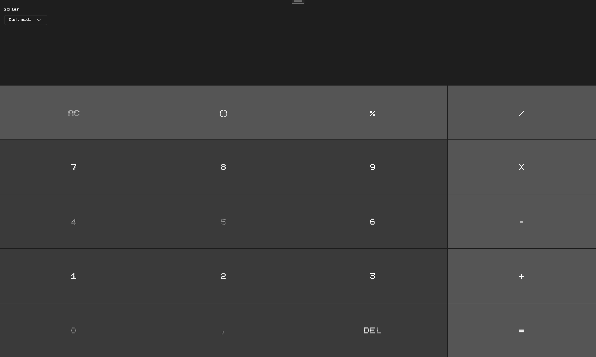
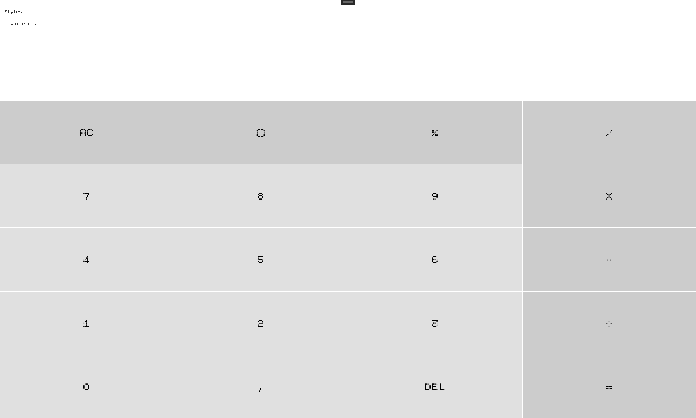
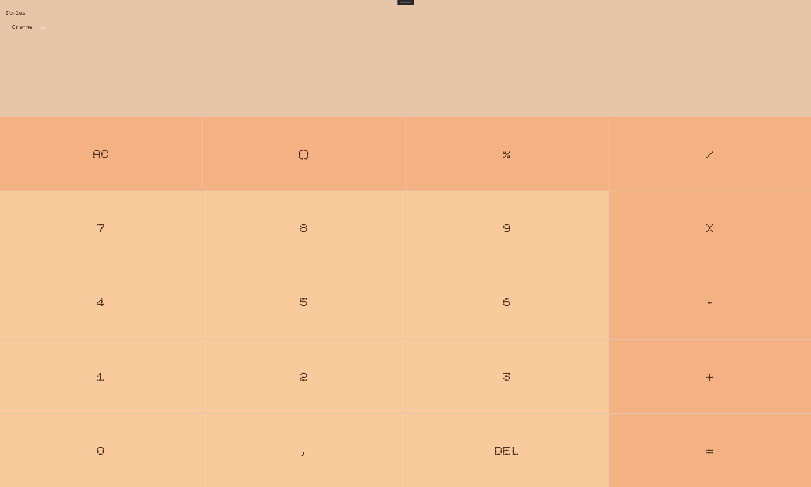
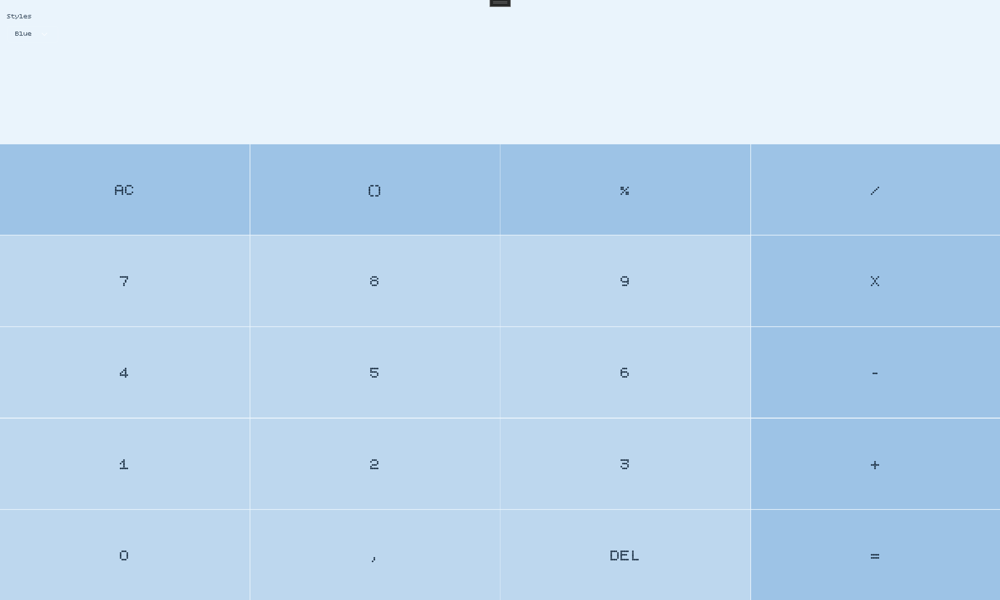
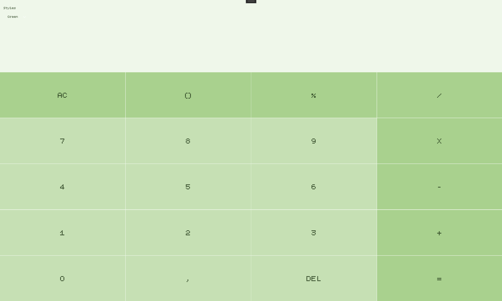
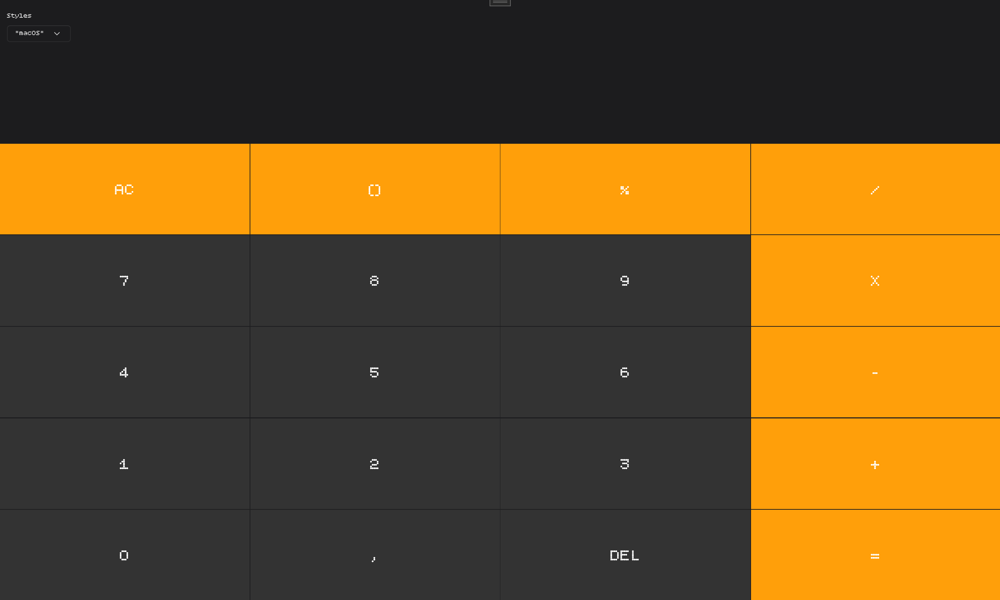

# Simple Calculator project
Project made to learn .NET MAUI

Still improving...

## Current screenshots

<h3>Dark Mode, Light Mode, Orange Theme</h3>

    
    
    

 
<h3>Blue Theme, Green Theme, "macOs" alike Theme</h3>

    
    
    

## Fonts

This project uses **Bitcount Single**, a font from [Google Fonts](https://fonts.google.com/specimen/Bitcount+Single).

* **Font:** Bitcount Single
* **License:** [SIL Open Font License 1.1 (OFL-1.1)](https://openfontlicense.org/)
* **Source:** [Google Fonts – Bitcount Single](https://fonts.google.com/specimen/Bitcount+Single)

The font is included in this project and is used in the application's UI.

The font is licensed separately from the application under the terms of the SIL Open Font License 1.1.

## License

This project is licensed under the MIT License.

If you use, modify, or redistribute this project or substantial portions of its source code, please retain the original copyright notice and license.

See the [LICENSE](/Calculator/Licenses/README.md) file for the full license text.

